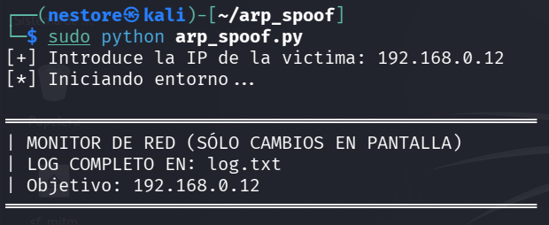

# ARP Spoofing & Network Monitor 🛡️💻
Este script en Python utiliza la librería Scapy para realizar un ataque de envenenamiento de tablas ARP (ARP Spoofing). Su objetivo principal es actuar como un "Man-in-the-Middle" (MitM) para interceptar, analizar y registrar el tráfico de red de un objetivo específico en una red local.

---

## 🚀 Características

- Envenenamiento ARP Dual: Afecta tanto a la víctima como a la puerta de enlace (gateway) para interceptar el tráfico en ambas direcciones.
- Monitoreo en Tiempo Real: Filtra y muestra en pantalla los sitios web visitados (HTTP) y consultas DNS.
- Extracción de Credenciales: Detecta y resalta palabras clave como **user**, **pass**, **login** y **mail** en paquetes HTTP Raw.
- Logging Persistente: Guarda un registro detallado de toda la actividad en un archivo **log.txt** con marcas de tiempo.
- Auto-Restauración: Al detener el script (Ctrl+C), se restauran automáticamente las tablas ARP originales para no dejar a la víctima sin conexión.
- Limpieza de Interfaz: Filtra dominios de telemetría (Google Analytics, métricas, etc.) en la salida de pantalla para un monitoreo más limpio.

---

## 🛠️ Requisitos previos

### Para ejecutar este script, necesitas:

- Sistema Operativo: Linux (recomendado Kali Linux o Parrot OS).
- Privilegios: Root/Sudo (necesario para manipular paquetes de red y el reenvío de IP).
- Python 3.x
- Entorno virtual

### Entorno virtual
```
python -m venv venv
```

```
source venv/bin/activate
```

### Librerías:
```
pip install scapy
```

---

## 📖 Modo de Uso
### Configuración de red:

Asegúrate de editar las variables **gateway_ip** e **interface** dentro del código según tu entorno (por defecto: 192.168.0.1 y eth0).

### Ejecución:
```
sudo python arp_spoof.py
```


### Interacción:
El script solicitará la IP del objetivo. Una vez introducida, habilitará automáticamente el **ip_forward** en el sistema para permitir que el tráfico fluya a través de tu máquina.

---

## 📊 Estructura del Log

El archivo **log.txt** se genera automáticamente y sigue el siguiente formato:
**[YYYY-MM-DD HH:MM:SS] [TIPO_TRAFICO] contenido_o_url**

Uso Ético: Este script ha sido creado únicamente con fines educativos y de auditoría de seguridad autorizada. El uso de esta herramienta en redes sin permiso explícito es ilegal y poco ético. El autor no se hace responsable del mal uso de este software.

---

## ⚙️ Cómo funciona técnicamente

- IP Forwarding: El script activa /proc/sys/net/ipv4/ip_forward para que tu equipo actúe como router.
- Spoofing: Envía paquetes ARP constantemente para engañar a los dispositivos.
- Sniffing: Utiliza la función sniff de Scapy para capturar el tráfico que ahora pasa por tu interfaz.
- Parsing: Analiza las capas **http.HTTPRequest** y **DNSQR** para extraer información legible.
